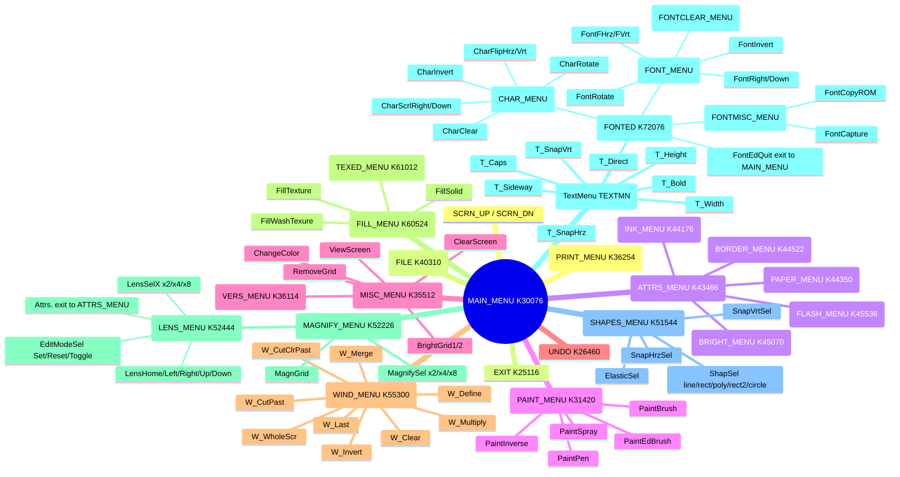

# Menu system

How Art Studio's menu/cursor engine works on MS-0515, as reconstructed in `ART.MAC`.
This is the generic UI substrate every feature menu (Paint, Fill, Shapes, Attrs,
Windows, Text, Font editor, Magnify, File, Print, Misc) is built on top of. It's a
close port of the Z80 original's `017-menu.asm`, and almost every routine here kept
its Z80 name (see `docs/z80-crossref.md` for the full cross-reference).

## Menu tree

All menus reachable from `MAIN_MENU` (`K30076`), with the label used for each and its
address. Matches the menu-to-Z80-file mapping in `docs/z80-crossref.md`.



Solid nodes are submenus (own `MenuOpen` struct); plain-text leaves are menu items
whose handler does something directly rather than opening another menu.

## Global state

| Var | Address | Role |
|---|---|---|
| `Menu_Addr` | K65276 | address of the currently open menu struct |
| `Menu_Xb` / `Menu_Yb` | K65300 / K65302 | screen origin of the current menu (item coords are relative to this) |
| `Menu_Attr` | K65304 | current menu's default item attribute byte |
| `CurCursAddr` | K62400 | address of the current mouse-cursor sprite (indexed via `TabCursor`) |
| `ScanCode` | K46222 | last decoded input event: bit0=right, bit1=left, bit2=up, bit3=down, bit4=fire/select, bit7=? |
| Mouse X/Y | K62374 / K62376 | current mouse position |
| `PrevScanCode` | K62412 | previous poll's ScanCode, used to detect held keys |
| `CursorStepRate` | K62406 | cursor movement step/speed |

Input arrives via `ScanKey` (K45776), which reads a key/mouse event through
`EMT 340` (`.TTYIN`) and decodes VT52 cursor-key escape sequences (`ESC A/B/C/D` =
Up/Down/Left/Right/etc, `ESC ?M` = fire/select) into the `ScanCode` bitmask — see the
comments at `K46022` (input method 0: keyboard) for the exact mapping.

## Menu struct layout

A menu is a flat data block passed by address in R5 to `MenuOpen`. 14-byte header,
then a list of items, terminated by a byte `255`:

```
Menu + 0   word   X
Menu + 2   word   Y
Menu + 4   word   Width
Menu + 6   word   Height
Menu + 8   byte   flags
             bit7 = clear menu box on open
             bit6 = draw frame
             bit5 = click outside menu box exits to previous menu
Menu + 9   byte   default item attrs
Menu + 10  word   exit handler address, or 0 (used by MenuBack)
Menu + 12  word   init handler address, or 0 (called once after drawing)
Menu + 14  ...    item list, ends with byte 255
```

Each item is a 12-byte header followed by its label text (ASCII, control codes for
ink/paper/flash/etc — see `MenuPrint` below):

```
Item + 0   word   X (relative to Menu_Xb)
Item + 2   word   Y (relative to Menu_Yb)
Item + 4   word   Width
Item + 6   word   Height
Item + 10  byte   (used as a "already drawn frame" flag, bit0 cleared after first pass)
Item + 11  byte   flags
             bit7 = clear item box on open
             bit6 = draw frame
             bit5 = invert (pressed/highlighted look)
Item + 12  word   handler address, or 0 (0 = decorative/non-interactive item)
```

Menu and submenu tables live in `ART.MAC` as `.WORD`/`.BYTE`/`.ASCII` data following
this layout — e.g. `MAIN_MENU` (`K30076`), `PAINT_MENU` (`K31420`), `FILL_MENU`
(`K60524`). See `docs/z80-crossref.md` for the full menu tree and which Z80 topic
file each submenu maps to.

## Core routines

**`MenuOpen`** (K63646) — draws a menu: sets `Menu_Addr`/`Menu_Xb`/`Menu_Yb`/`Menu_Attr`,
optionally clears the menu box, then walks the item list drawing each item's box/frame
and calling `MenuPrint` for its text, inverting it if the "pressed" flag is set. Finally
draws the outer frame if requested and jumps to the init handler if one is set.

**`MenuPrint`** (K64262) — prints one item's label string at a given position, honoring
embedded control codes for ink/paper/flash/bright/pixel-mode/coordinate-jump (codes
0x10-0x17), mirroring the Z80 `MenuCod1`-`MenuCod7` dispatch. Uses `M_SkipChr`
(K65242) to walk the string one logical character at a time (handling control codes),
and `M_LnSize` (K65116) to sum up a run's pixel width (for centering text via
`TabChrSz`).

**`MenuRange`** (K63554) — hit-test: is the mouse inside the rectangle at R3/R4 sized
R1xR2? Returns Z on hit (matches Z80's Z-flag-as-hit-result convention).

**`MenuCheck`** (K62414) — hover loop: walks the current menu's items, calling
`MenuRange` on each, and highlights (via `MenuFlash`) the one under the cursor if
any. Called every iteration of the main input loop while the mouse moves without a
click.

**`MenuFlash`** (K63306) — toggles the highlighted/pressed look of one item (bit0/bit6
of its flags byte), calling `PixInvert` when the highlight state actually changes.

**`MenuExe`** (K63366) — like `MenuCheck` but on click: finds which item the mouse is
over and returns its handler address in R3 (or 0 if none). Used by `MenuSel`.

**`MenuSel`** (K62652) — the click handler: calls `MenuExe` to find the clicked item,
flashes it, and jumps to its handler address (or does nothing if the click missed
every item / hit a decorative item with handler 0).

**`MenuBack`** (K63530) — pops back to the previous menu: reads the current menu's
"exit" field (Menu + 10) and, if non-zero, opens that menu via `MenuOpen`; otherwise
just returns (no parent to go back to).

**`MenuBeep`** (K61700) — stub; MS-0515 doesn't implement the click sound the Z80
original had here.

## Cursor / input loop

**`SetCursAddr`** (K62000, `R0` = cursor number) — looks up `TabCursor[R0]`, sets
`CurCursAddr`, resets the movement-step counters.

**`PutCursor`** (K12054) — draws the mouse cursor sprite at its current position,
clipped to screen, after calling `CursSave` to back up the pixels underneath. Cursor
0 uses a dedicated fast path (`PutCursMain`, K12612); all other cursor numbers go
through the generic bitmap blitter (`P_Curs1`, K12132). Cursor sprite format (via
`TabCursor` → `CurCursAddr`): byte width, byte height, byte offsetX, byte offsetY,
then row data.

**`JCursHide`** (K13110, alias `CursorHide`) — restores the screen area saved by
`CursSave`, undoing the last `PutCursor`.

**`CursSave`** / **`GetBuff`** (K13114 / K13514) — the save/restore pair `PutCursor`
and `JCursHide` are built on: `CursSave` copies a WxH pixel rect into a small ring
buffer (with its position), `GetBuff` pops the most recent one back off.

**`cp_ArrY`** (K61670) / **`cp_ArrFire`** (K61706) — small guards used in the
mouse-tracking loops: `cp_ArrY` checks the mouse Y is within the visible 24-row band;
`cp_ArrFire` checks it's within the current cursor sprite's row bounds (used to decide
whether to redraw the cursor at all).

## The typical menu loop

Every interactive menu (see `MAIN` at K61120, or `WindDragLoop` at K53126 for a
window-specific variant) follows the same shape:

```
loop:
    PutCursor                  ; draw cursor
    PassFire                   ; wait for input
    ScanKey                    ; decode ScanCode
    if fire bit set:
        JCursHide
        MenuBeep
        MenuSel                ; dispatch the click
    else:
        (move mouse per ScanCode)
        JCursHide
        PutCursor
        MenuCheck               ; hover-highlight
    goto loop
```

`EDIT` (K61246) is the generalized version of this loop used for interactive
drag/paint operations (brush dragging, shape rubber-banding, window selection) —
it's parameterized by a jump-address table and item count rather than a menu struct,
but follows the same read-input / redraw-cursor / dispatch cycle.
